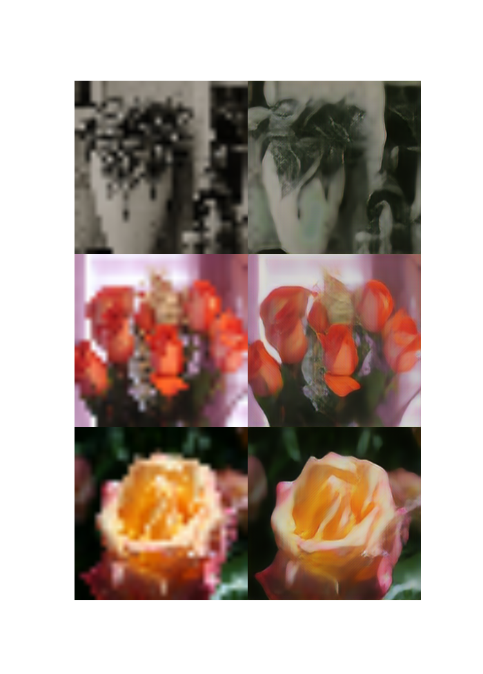
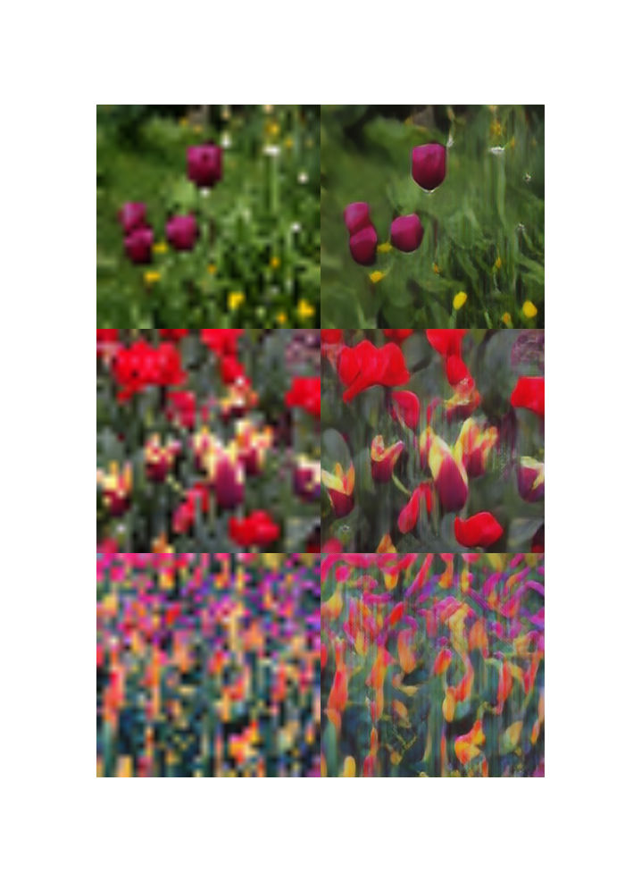
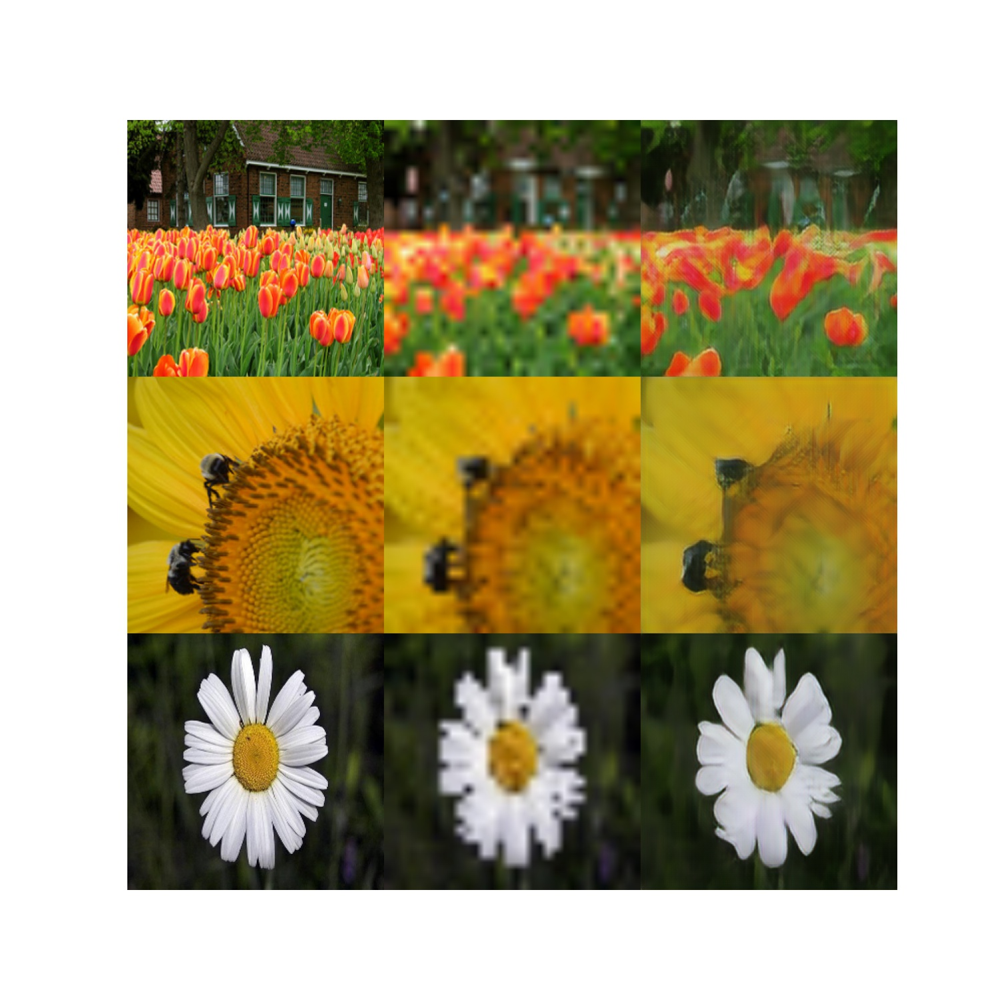
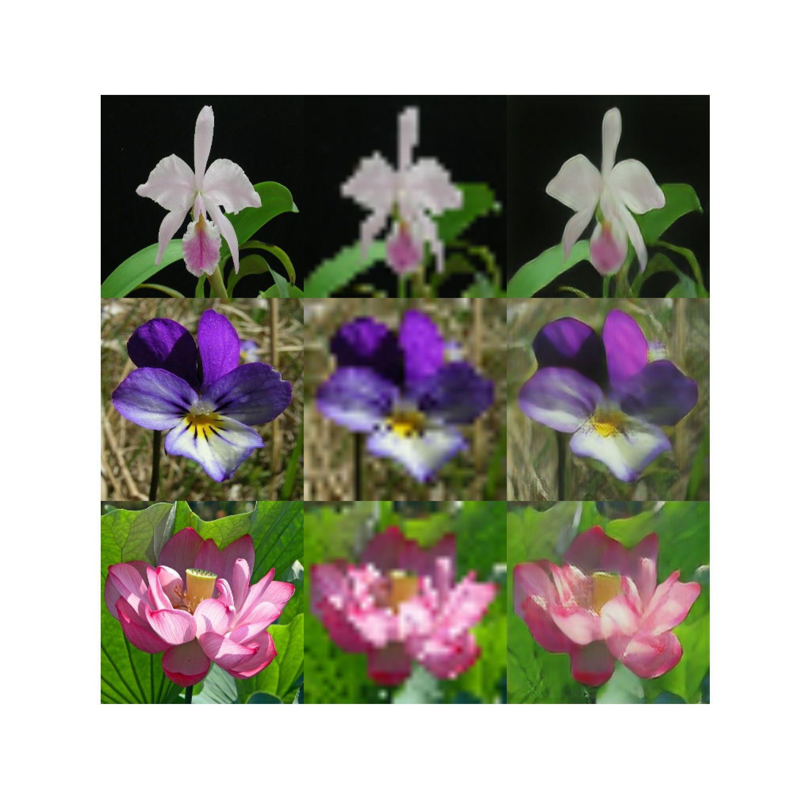
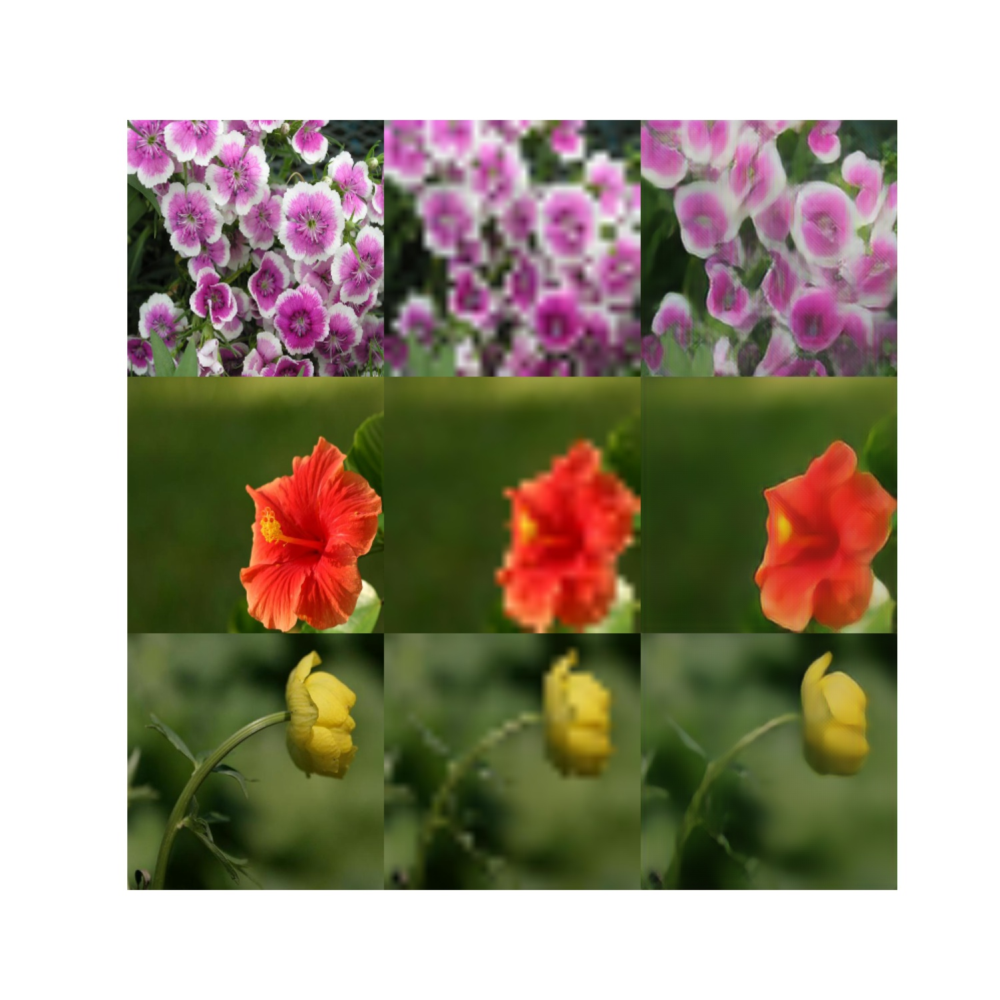

# Flower_Super_Resolution_Deep_Learning
Test on super resolution using perceptual loss

**New model uses a GAN and Perceptual mixture inspired by SRGAN**

## OLD Results

Last epochs inferences. First image is the original, second the low-res input and last the prediction.

## NEW Results

Using a GAN and U-Net generator.

